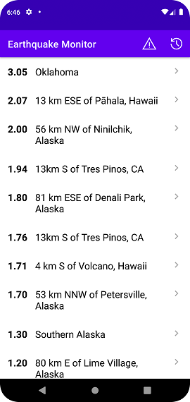

# android_kotlin_earthquake_monitor_app

## Arquitectura MVVM en Android

Vamos a empezar a implementar la arquitectura MVVM en la app de Monitor de Terremotos, empezaremos por la descarga de datos de internet:


Temas que vamos a trabajar para esto son: 

- API´s y como comunicarte con ella.

- Qué es JSON

- Retrofit, una de las librerías más usadas en Android para descargar datos de internet.

- Aprenderás qué son coroutines (Corutinas) y por qué son tan necesarias.

- Implementarás la parte señalada en la imagen de la arquitectura MVVM.

Recordemos que la parte de la arquitectura que une Activities/Fragments con los ViewModels usando LiveData ya la aplicamos en la arquitectura de la Basketball Score App. 

¿Que es una API? 

Es una "Interfaz de programación de aplicaciones" que conecta una aplicación (Logistics App por ej) con un servidor (Fleet Management por ejemplo).

Una API que usa el protocolo HTTP para comunicarse es comunmente denominada como API REST. Normalmente, los softwares que trabajan con este tipo de API´s lo hacen a traves de codigo XML o JSON. 

Desde nuestra APP Android podemos obtener información en estos formatos pegandole a esta API, por ejemplo con una GET request y usar esa información para pintarla en pantalla o para realizar operaciones lógicas, según nuestra necesidad. 

--------------------------

https://earthquake.usgs.gov/earthquakes/feed/v1.0/geojson.php

En ese link vamos a encontrar la API de terremotos reales del centro USGS. Allí vamos a encontrar el formato en que esta API nos devuelve la información y como pegarle a la mismo (RFC de una API). 

RFC = Request for comments

Algunas API´s te pidan una API Key para poder pegarle pero en este caso, vamos a usar una que es completamente libre. Por lo que no será necesario. 

Para descargar datos de esta API o cualquier otra en nuestra APP Android vamos a usar una librería llamada Retrofit. 

Voy a crear un file Kotlin donde guardaré mi conexión con la API. (Ej EqApiService)

Podemos copiar y pegar el codigo desde la docu de retrofit (Está en Java pero Android Studio lo va a convertir en Kotlin directamente)

Le cambiamos el nombre a nuestra interface según nuestra necesidad. En este caso EqApiService. 

Tmabién vamos a cambiar algunos otros parametros en función de nuestra necesidad, la URL de la API a la que vamos a pegar, etc. 

Una vez lista copiamos y pegamos de la docu oficial la siguiente parte del codigo: 

Docu oficial aquí: https://square.github.io/retrofit/

Base URL de nuestra API de terremotos sería: https://earthquake.usgs.gov/earthquakes/feed/v1.0/summary/ para cada caso lo debemos entontrar viendo como varía la URL en función de los distintos endpoints. 

Luego buscamos la parte de la dirección del endpoint que necesitamos para cada request. Por ejemplo el endpoint de todos los terremotos de la ultima hora es: 
all_hour.geojson

Finalmente vamos setear a la var retrofit como private var y vamos a agregar la dependencia de scalar converter a nuestro build.gradle para poder lograr que lo que nos devuelve la API sea formato string. 

```kotlin
implementation 'com.squareup.retrofit2:converter-scalars:2.5.0'
```

Así nos quedaría entonces nuestro EqApiService: 

```kotlin
import retrofit2.Retrofit
import retrofit2.converter.scalars.ScalarsConverterFactory
import retrofit2.http.GET


interface EqApiService {
    // Aquí podría agregar todos tipos de request que quisiera. En este caso solo voy a usar el GET.
    @GET("all_hour.geojson")
    fun getLastHourEarthquakes(): String
}

private var retrofit = Retrofit.Builder()
    .baseUrl("https://earthquake.usgs.gov/earthquakes/feed/v1.0/summary/")
    .addConverterFactory(ScalarsConverterFactory.create())
    .build()

var service: EqApiService = retrofit.create(EqApiService::class.java)
```

Finalmente sumo en el MainActivity el encendido de mi conexión con la API: 

```kotlin
// Me conecto desde el main con la API de terremotos. 
service.getLastHourEarthquakes()
```

En realidad esta conexión con la API la debemos hacer en un ViewModel. Por lo que construiremos el mismo y pasaremos no solo la conexión con la API sino toda la "lógica de negocio" del MainActivity al MainViewModel dejando en MainActivity solamente aquello que refiera a las interacciones entre el usuario y la app. 

---------------------

Construimos nuestro ViewModel: 

1- Implementamos la dependencia necesaria para trabajar con ViewModels: 

```kotlin
implementation 'androidx.lifecycle:lifecycle-viewmodel-ktx:2.2.0'
```

**Trucazo en Android Studio e Intellij IDEA:** Presionando Crtl + Alt + M y teniendo seleccionado una porción de codigo podemos separar el mismo y asignarlo a un metodo (función de una clase) independiente de donde estamos programando el codigo.  

-----------------------

¿Que son los thread en Android? 

Son procesos que corre un programa. Cada proceso puede correr en un mismo thread o dividirse en threads distintos. El riesgo de que todo vaya en el main thread es que la aplicación colapse. Por lo que se recomienda llevar adelante las operaciones mas pesadad como descargar una imagen o información de un servidor en thread separados. 

Los threads o hilos secundarios normalmente decimos que corren en el background de la aplicación. 

Por ej: podemos tener una app con tres threads corriendo a la vez distribuidos así: 

- Main thread (UI)
- Thread 2: Descarga de una imagen
- Thread 3: Inserta en la base de datos

Para crear hilos o threads diferentes en Android debemos usar algo llamado "corroutines" o "corrutinas en español". 

Las corrutinas son procesos a los que les podemos indicar en qué hilo queremos que se ejecuten.
Y se ven, así como el init, por ejemplo, o como un método normal.

Para crear una corrutina lo primero que tenemos que hacer es inicializar una private val "job"(o cualquier otro nombre) que va a ser asignada como Job()

Luego debemos crear otra private val que va a definir el Scope o alcance de nuestra Coroutine. Para ello debemos seleccionar cual va a ser el dispatcher. Entre los mas usuales están: 

- Main: se usa para ejecutar todo lo relacionado con la experiencia del usuario (UI)
- IO (Input/Output): Se usa para todos los procesos que implican manejar datos. 
- Default: Otros usos
- Unconfined: Hacer testing

Finalmente le agregamos el job creado al scope de nuestra coroutineScope. 

```kotlin
private val job = Job()
private val coroutineScope = CoroutineScope(Dispatchers.Main+ job)
```

Explicación del codigo de arriba: 

Entonces lo que acabamos de hacer aquí es que creamos este job que se inicializa automáticamente al crearlo y luego creamos este scope o este alcance que va a ejecutarse en el hilo principal y va a estar vivo mientras esté vivo el job.

¿Y cuánto tiempo queremos que esté vivo el job?

Pues el mismo tiempo que esté vivo el ViewModel.

Entonces al final del ViewModel vamos a agregar algo que se llama onCleared() que se va a ejecutar cuando el ViewModel vaya a morir y aquí vamos a matar el job.

```kotlin
override fun onCleared() {
    super.onCleared()
    job.cancel()
}
```

Si no hacemos esto la aplicación va a seguir el job y el telefono seguirá destinando recursos a esta tarea. Por eso es importante terminar el job al terminar de ejecutar nuestro ViewModel.

**IMPORTANTE**: Las corrutinas adicionales a la principal se deben crear dentro de la corrutina main. Y no fuera. Ahora mostramos como: 

En el init{} es donde vamos a "lanzar" el trabajo de nuestra corrutina principal y nuestras corrutinas secundarias en caso de que sea necesario. 

Luego por fuera de la corrutina IO pero dentro de la corrutina Main voy a actualizar mi LiveData con la info traida de la primera

```kotlin
    init {
        // Lanzo la corrutina principal y dentro de ella una secundaria del tipo IO para armar mi lista.
        // La corrutina secundaria debe devolverle a la corrutina primaria la lista de terremotos al
        // finalizar su ejecución.
        coroutineScope.launch {
            val eqList = withContext(Dispatchers.IO) {
                val eqList =  mutableListOf<Earthquake>()

                // Hardcodeo mi lista vacia para que tenga elementos que mostrar:
                eqList.add(Earthquake("1","Buenos Aires",4.3,275349574L, -102.4756, 28.47365))
                eqList.add(Earthquake("2","Lima",2.9,275349574L, -102.4756, 28.47365))
                eqList.add(Earthquake("3","Ciudad de México",6.0,275349574L, -102.4756, 28.47365))
                eqList.add(Earthquake("4","Bogotá",4.1,275349574L, -102.4756, 28.47365))
                eqList.add(Earthquake("5","Caracas",2.5,275349574L, -102.4756, 28.47365))
                eqList.add(Earthquake("6","Madrid",3.3,275349574L, -102.4756, 28.47365))
                eqList.add(Earthquake("7","Acra",6.3,275349574L, -102.4756, 28.47365))

                eqList
            }
            _eqList.value = eqList
        }
    }
```

Hecho esto la obtencion de la información, que por el momento está hardcodeada se va a realizar en backgorund y la asignación de esa información al LiveData para luego pintarla en pantalla se realizará en el Main Thread. 

Esto mismo podriamos hacerlo usando un metodo para llevar adelante el cargado dentro del scope de la corrutina IO así: 

init{}

```kotlin
    init {
        // Lanzo la corrutina principal y dentro de ella una secundaria del tipo IO para armar mi lista.
        // La corrutina secundaria debe devolverle a la corrutina primaria la lista de terremotos al
        // finalizar su ejecución.
        coroutineScope.launch {
            _eqList.value = fetchEarthquakes()
        }
    }
```

private **suspend** fun fetchEarthquakes() {}

```kotlin
    private suspend fun fetchEarthquakes(): MutableList<Earthquake> {
        return withContext(Dispatchers.IO) {
            val eqList =  mutableListOf<Earthquake>()

            // Hardcodeo mi lista vacia para que tenga elementos que mostrar:
            eqList.add(Earthquake("1","Buenos Aires",4.3,275349574L, -102.4756, 28.47365))
            eqList.add(Earthquake("2","Lima",2.9,275349574L, -102.4756, 28.47365))
            eqList.add(Earthquake("3","Ciudad de México",6.0,275349574L, -102.4756, 28.47365))
            eqList.add(Earthquake("4","Bogotá",4.1,275349574L, -102.4756, 28.47365))
            eqList.add(Earthquake("5","Caracas",2.5,275349574L, -102.4756, 28.47365))
            eqList.add(Earthquake("6","Madrid",3.3,275349574L, -102.4756, 28.47365))
            eqList.add(Earthquake("7","Acra",6.3,275349574L, -102.4756, 28.47365))

            eqList
        }
    }
```

La regla es que si utilizamos withContext() y el mismo no está dentro de una corrutina sino en un metodo. El mismo debe ser declarado como private **suspend** fun para que pueda ejecutarse

Todo esto está muy bien pero, en la actualidad existe una forma mucho mas sencilla de armar nuestras corrutinas dentro del ViewModel y sae hace con "viewModelScope" en reemplazando todo el codigo del job y el coroutineScope así como también la función para detener el job al cerrar el ViewModel.

El codigo de nuestro viewModel finalmente quedaría así: 

```kotlin
class MainViewModel: ViewModel() {

    private var _eqList = MutableLiveData<MutableList<Earthquake>>()

    val eqlist: LiveData<MutableList<Earthquake>>
        get() = _eqList

    init {
        viewModelScope.launch {
            _eqList.value = fetchEarthquakes()
        }
    }

    private suspend fun fetchEarthquakes(): MutableList<Earthquake> {
        return withContext(Dispatchers.IO) {
            val eqList =  mutableListOf<Earthquake>()

            eqList.add(Earthquake("1","Buenos Aires",4.3,275349574L, -102.4756, 28.47365))
            eqList.add(Earthquake("2","Lima",2.9,275349574L, -102.4756, 28.47365))
            eqList.add(Earthquake("3","Ciudad de México",6.0,275349574L, -102.4756, 28.47365))
            eqList.add(Earthquake("4","Bogotá",4.1,275349574L, -102.4756, 28.47365))
            eqList.add(Earthquake("5","Caracas",2.5,275349574L, -102.4756, 28.47365))
            eqList.add(Earthquake("6","Madrid",3.3,275349574L, -102.4756, 28.47365))
            eqList.add(Earthquake("7","Acra",6.3,275349574L, -102.4756, 28.47365))

            eqList
        }
    }
}
```

Las dos formas de trabajar con corrutinas conviven en la actualidad. Esta forma última solo sirve si encendemos las corrutinas en nuestro viewModel. Pero si lo hacemos en otra clase necesariamente debemos trabajar las corrutinas con la primera forma. 

-----------------

Ahora debemos reemplazar nuestra lista hardcodeada por la lista que traemos desde la API. 

Consideraciones: 

1- Como el metodo de service para la request "GET" lo estamos llamando desde dentro de una corrutina debemos agregarle el suspend al mismo. Así: 

```kotlin
interface EqApiService {
    // Aquí podría agregar todos tipos de request que quisiera. En este caso solo voy a usar el GET.
    @GET("all_hour.geojson")
    suspend fun getLastHourEarthquakes(): String
}
```

Luego en nuestro AndroidManifest que es donde van nuestros permisos debemos darle a la app el permiso para que el usuario acceda a internet agregando lo siguiente antes de <application...>: 

```xml
<uses-permission android:name="android.permission.INTERNET"/>
```

Luego vamos a modificar el hardcodeo de nuestro lista en el metodo fetch... para traer los terremotos desde la API. Recordemos acá que los vamos a traer en formato String por lo que debemos transformarlos a una MutableList para poder usarlos y pintarlos. 

**Friendly Reminder:** Lo ultimo que escribimos dentro de una corrutina será lo que devolverán.  

Este String que recibimos en realidad es JSON. Solo que como tal no es un dato nativo de Kotlin. Una vez que visualizamos que el JSON esté viniendo como queremos (podemos usar un Log.d y luego ver lo que nos trae a traves del Logcat). Con este JSON lo que ahora debemos hacer es "PARSEARLO" para convertirlo en objetos terremotos dentro de una mutable list. 

### Componentes de un JSON Object: 

- Otros JSON Objects
- JSON Arrays
- Elementos (de diversos tipos como Double, Int, String, Bool, etc)

**¿Como parseamos entonces?**  

Usando un metodo para esta tarea que vamos a crear y recurriendo a alguna librería (todos los lenguajes la tienen) que nos permita realizar este parseo de forma simple y en pocas lineas. 

Dentro de mi JSON obtenido y parseado voy a encontrar una parte que se llama "features" y dentro del mismo van a estar las properties que necesito para crear mis objetos terremos. Debo entonces acceder a las mismas para construir mis objetos. 

Como estoy trayendo mas de un terremoto. Traigo todos los ocurridos en la ultima hora. Entonces debo armar un array de terremotos o de mis features de terremotos. 

Debemos observar con detenimiento como están encadenados los json object dentro de la respuesta de la API. Dado que en función de esto es que vamos a poder obtener la información que necesitamos. 

Por ejemplo. El valor "id" del terremoto viene dentro del JSON object "features" pero el valor "place", "time" y otros vienen dentro del JSON object "properties" que es un sub objeto dentro del objeto features. 


```kotlin
class MainViewModel: ViewModel() {
    // Migramos la lista de terremotos como Mutable live data:
    private var _eqList = MutableLiveData<MutableList<Earthquake>>()

    // Creamos también el LiveData que sea "pareja" de nuestro mutable live data de arriba
    // Esta variable es la que voy a observar desde el main activity para que cuando cambie pinte
    // los cambios ocurridos en nuestra activity:
    val eqlist: LiveData<MutableList<Earthquake>>
        get() = _eqList

    init {
        // Lanzo la corrutina principal y dentro de ella una secundaria del tipo IO para armar mi lista.
        // La corrutina secundaria debe devolverle a la corrutina primaria la lista de terremotos al
        // finalizar su ejecución.
        viewModelScope.launch {
            _eqList.value = fetchEarthquakes()
        }
    }

    private suspend fun fetchEarthquakes(): MutableList<Earthquake> {
        return withContext(Dispatchers.IO) {
            // Guardo en String lo que viene de la API.
            val eqListString =  service.getLastHourEarthquakes()
            // Transitoriamente voy a visualizar que es lo que viene con un Log.d:
            // Log.d("TEST_API", eqListString)
            // Invoco mi función para "parsear" mis datos JSON/String obtenidos de la API:
            val eqList = parseEqResult(eqListString)
            eqList
        }
    }

    private fun parseEqResult(eqListString: String): MutableList<Earthquake> {
        // Convierto mi String en un JSON Object:
        val eqJsonObject = JSONObject(eqListString)

        // Armo entonces un array de las "features" que vienen en mi json para luego armar terremotos
        val featuresJsonArray = eqJsonObject.getJSONArray("features")

        // Armo la lista vacia que luego de completar voy a devolver:
        val eqList = mutableListOf<Earthquake>()

        // Itero mi arreglo para armar mis featuresJsonObject que luego serán la base de mis terremotos:
        for (i in 0 until featuresJsonArray.length()) {
            val featuresJsonObject = featuresJsonArray[i] as JSONObject
            // Ya tenemos el primer objetoJSON separado por lo que podemos ir guardando su información para
            // luego contruir nuestro objeto:
            val id = featuresJsonObject.getString("id")

            // magnitude, places, time,etc están dentro de un sub objeto de features
            val propertiesJsonObject = featuresJsonObject.getJSONObject("properties")
            val magnitude = propertiesJsonObject.getDouble("mag")
            val place = propertiesJsonObject.getString("place")
            val time = propertiesJsonObject.getLong("time")

            // Finalmente longitude y latitude están dentro de otro sub objeto de features
            val geometryJsonObject = featuresJsonObject.getJSONObject("geometry")
            val coordinatesJsonArray = geometryJsonObject.getJSONArray("coordinates")
            val longitude = coordinatesJsonArray.getDouble(0)
            val latiitude = coordinatesJsonArray.getDouble(1)

            val earthquake = Earthquake(id,place,magnitude,time,longitude,latiitude)
            eqList.add(earthquake)
        }
        return eqList
    }
```

Esta es entonces una de las formas en la que podemos traernos información desde internet directamente usando **retrofit**. 

Veamos ahora otra alternativa para parsear JSON: 

------------------------------

**Moshi:** (Existe otra que se llama Gson y es muy similar)

Moshi en lugar de obtener de la API un String nos va a devolver directamente un objeto JSON. 

Para agregarlo lo primero es sumar la implementation en build:gradle: 

```xml
implementation 'com.squareup.retrofit2:converter-moshi:2.5.0'
```

Luego vamos a cambiar la configuración de nuestro EqApiService. 

Habiamos setiado el addConverterFactory para que convierta a String la respuesta de la API a la que le pegamos. 

Ahora debemos cambiar esa config para que sea Moshi el que ocupe su lugar así: 

```kotlin
interface EqApiService {
    @GET("all_hour.geojson")
    suspend fun getLastHourEarthquakes(): EqJsonResponse
}

private var retrofit = Retrofit.Builder()
    .baseUrl("https://earthquake.usgs.gov/earthquakes/feed/v1.0/summary/")
    .addConverterFactory(MoshiConverterFactory.create())
    .build()

var service: EqApiService = retrofit.create(EqApiService::class.java)
```

Luego armomos una clase que nos sirva para recibir lo que Moshi nos devuelve. 

La llamaremos EqJsonresponse: 

En ella vamos a declarar los parametros de la respuesta de la API pero solo los que necesitamos. En este caso por ejemplo no nos sirve agregar el parametro de la respuesta llamado "bbox" o "metadata"

Por cada parametro que quiero recibir voy a armar una clase para recibirlo como parametro de mi class EqJsonResponse dentro de una lista: 

Dentro del objeto/parametro feature que es uno de los que vamos a recibir por ejemplo tengo que seleccionar también que parametros del mismo van a conformar el objeto porque luego serán usados para conformar mi Json con Moshi: 

Quedarían conformados entonces las siguientes clases: 

- EqJsonResponse: 
```kotlin
class EqJsonResponse(val features: List<Feature>)
```
- Feature:
```kotlin
class Feature(val id: String, val properties: Properties, val geometry: Geometry)
```
- Properties:
```kotlin
class Properties(val mag: Double, val place: String, val time: Long)
```
- Geometry:
```kotlin
class Geometry(val coordinates: Array<Double>) {
    // Uso getters para obtener los valores del array que recibo en el JSON.
    val longitude: Double
        get() = coordinates[0]

    val latitude: Double
        get() = coordinates[1]
}
```

Y ahora con Moshi instalado podemos hacer que el resultado de la request GET venga directamente como EqJsonResponse que es el otro cambio que le hicimos al EqApiService arriba.

Luego vamos a modificar nuestra función de parseEqResult dado que ya no recibiremos un string sino un EqJsonResponse para que quedé así nuestro ViewModel: 

```kotlin
class MainViewModel: ViewModel() {

    private var _eqList = MutableLiveData<MutableList<Earthquake>>()
    val eqlist: LiveData<MutableList<Earthquake>>
        get() = _eqList

    init {
        viewModelScope.launch {
            _eqList.value = fetchEarthquakes()
        }
    }

    private suspend fun fetchEarthquakes(): MutableList<Earthquake> {
        return withContext(Dispatchers.IO) {
            val eqList = service.getLastHourEarthquakes()
            parseEqResult(eqList)
        }
    }

    private fun parseEqResult(eqJsonResponse: EqJsonResponse): MutableList<Earthquake> {
        // Armo la lista vacia que luego de completar voy a devolver:
        val eqList = mutableListOf<Earthquake>()

        // Obtengo los distintos features de mi eqJsonResponse
        val featureList = eqJsonResponse.features

        // Ahora convertimos nuestro objeto EqJsonResponse en Terremotos así:
        for (feature in featureList) {
            val id = feature.id
            val place = feature.properties.place
            val magnitude = feature.properties.mag
            val time = feature.properties.time
            val longitude = feature.geometry.longitude
            val latitude = feature.geometry.latitude
            val earthquake = Earthquake(id, place, magnitude, time, longitude,latitude)
            eqList.add(earthquake)
        }
        return eqList
    }
}
```

**Importante:** para que Moshi funcione los nombres de los atributos de las clases que construimos con el fin de recibir el objeto en formato JSON deben ser exactamente los mismos que como están escritos en el JSON de la API a la que le estamos pegando.  

Pero existe una forma de trabajarlo con un nombre diferente como por ejemplo "magnitude". Para ello debemos agregar antes de nuestro atributo un "@Json(name="mag")" y luego definir la variable como queramos. por ejemplo así: 

```kotlin
import com.squareup.moshi.Json

class Properties(@Json(name = "mag") val magnitude: Double, val place: String, val time: Long)
```

------------------------

Muy bien. Ya tenemos entonces nuestra **Activity**, tenemos nuestro **ViewModel** y tenemos nuestro **Remote Data Source** al que conectamos con un **webservice** usando **Retrofit**

¿Que nos falta para respetar nuestra **arquitectura MVVM**?

- Debemos crear nuestro **Repository** (Vamos a hacerlo ahora). El objetivo del repositorio recordemos que es que nuestros datos lleguén al ViewModel siempre desde una única fuente (El Repository)

- Debemos crear nuestro **Model** (Lo haremos luego junto con la conexión con nuestra base de datos.)

### Recordemos nuestro diagrama MVVM nuevamente: 



1- Creamos en nuestro unico paquete una clase a la que llamaremos MainRepository

2- Pasamos todo el codigo de conexión y transformación de los datos con el servicio web que usamos (La API) a nuestro repository quitandolo de nuestro ViewModel

3- Convierto mis metodos/funciones que eran privados en publicos dado que serán llamados desde nuestro ViewModel

4- Creo un objeto repositorio en mi ViewModel

5- Uso el metodo publico de mi repositorio desde mi ViewModel

El ViewModel nos queda así: 

```kotlin
class MainViewModel: ViewModel() {

    private var _eqList = MutableLiveData<MutableList<Earthquake>>()
    val eqlist: LiveData<MutableList<Earthquake>>
        get() = _eqList

    private val repository = MainRepository()

    init {
        viewModelScope.launch {
            _eqList.value = repository.fetchEarthquakes()
        }
    }
}
```

El MainRepository nos queda así: 

```kotlin
class MainRepository {
    suspend fun fetchEarthquakes(): MutableList<Earthquake> {
        return withContext(Dispatchers.IO) {
            val eqJsonResponse = service.getLastHourEarthquakes()
            val eqList = parseEqResult(eqJsonResponse)
            eqList
        }
    }

    private fun parseEqResult(eqJsonResponse: EqJsonResponse): MutableList<Earthquake> {
        // Armo la lista vacia que luego de completar voy a devolver:
        val eqList = mutableListOf<Earthquake>()

        // Obtengo los distintos features de mi eqJsonResponse
        val featureList = eqJsonResponse.features

        // Ahora convertimos nuestro objeto EqJsonResponse en Terremotos así:
        for (feature in featureList) {
            val id = feature.id
            val place = feature.properties.place
            val magnitude = feature.properties.magnitude
            val time = feature.properties.time
            val longitude = feature.geometry.longitude
            val latitude = feature.geometry.latitude
            val earthquake = Earthquake(id, place, magnitude, time, longitude,latitude)
            eqList.add(earthquake)
        }
        return eqList
    }
}
```

Ahora es la clase MainRepository la que se encarga de comunicarse con nuestro web service y en un futuro será la misma clase la que se comunique con nuestras bases de datos. 

Finalmente vamos a setear el formato en el que queremos que se nos muestre la magnitud de los terremotos dado que vienen algunos con multiples decimales y yo solo quiero 2 de ellos. 

Lo primero es crear un formato en strings.xml con el que forzamos a un número float o double a ser de dos decimales:

```xml
<string name="magnitude_format">%.2f</string>
```

Luego en EqAdapter, cuando insertamos la magnitud, vamos a cambiar esto:

```kotlin
binding.eqMagnitudeText.text = earthquake.magnitude.getString()
```
Por esto: 

```kotlin
binding.eqMagnitudeText.text = context.getString(R.string.magnitude_format, earthquake.magnitude)
```

Pero observando detenidamente vamos que se necesita un context para usar el getString, entonces en el constructor de EqAdapter agregaremos un context así:

```koltin
class EqAdapter(private val context: Context): ...
```

Finalmente, desde MainActivity, pasamos el context al adapter así:

```koltin
val adapter = EqAdapter(this)
```

Y listo. Tenemos seteados los Double de la magnitud con 2 decimales solamente. 

-------------------------

**¿Como estructuramos nuestra clases para que queden bien acomodadas y respeten una estructura de "Clean Code"?**

No se debe acomodar todas las activities en una carpeta llamada activities y todos los adaptar en una llamada adapter sino que por el contrario es mejor acomodar nuestras clases/archivos por "features"

Todo estará dentro de "com.mgobeaalcoba.earthquake": 

- api
  - EqApiService.kt
  - EqJsonResponse.kt
  - Feature.kt
  - Geometry.kt
  - Properties.kt
- main
  - MainActivity.kt
  - EqAdapter.kt
  - MainViewModel.kt
  - MainRespository.kt
- database
- Earthquake.kt

**Criterio para cuando sumamos nuevas pantallas:** 

- Solo tendremos un paquete de API y un paquete de Databases. En el mismo sumaremos todas las conexiones y request necesarias. Puede ser para pegarle a una API o a muchas API´s. A una databases o a muchas databases. 
- Por cada pantalla de nuestra app si tendremos un paquete para esa pantalla y en el mismo tendremos su propio MainActivity, su propio MainViewModel y su propio MainRepository. Si es necesario (si tiene recycler views) entonces también su propio adapter. 
- Una activity también podría tener distintos fragments. Pero eso lo desarrollamos luego. 

---------------------------

**¿Que es Room?** 

Es una librería que nos va a permitir implementar bases de datos para Android. Es la forma recomendada para hacerlo. 

Room funciona ensima de SQL y nos va a facilitar bastante el uso de SQL. 

Para usar Room (Librería de base de datos) necesitarás las siguientes dependencias, agrégalas a tu archivo build.gradle (App):

```kotlin
implementation 'androidx.room:room-runtime:2.2.5'

kapt 'androidx.room:room-compiler:2.2.5'
```

¿Como comenzamos entonces a trabajar con Room? 

1- Las clases que vayamos a guardar en nuestra base de datos deben ser "data class" 

2- Debemos agregarle a nuestras data class que vayamos a guardar una anotación arriba del tipo **@Entity(tablename = "nombre_tabla")**

3- Agrego una anotación de @PrimaryKey a aquel atributo de nuestra clase que será el "id" de nuestra tabla. **@PrimaryKey**

Quedaría así nuestra clase: 

```kotlin
import androidx.room.Entity
import androidx.room.PrimaryKey

@Entity(tableName = "earthquakes")
data class Earthquake(
    @PrimaryKey val id: String,
    val place: String,
    val magnitude: Double,
    val time: Long,
    val longitude: Double,
    val latitude: Double )
```

--------------------------

DAO´s = Interface que nos va a ayudar a insertar y tomar datos de nuestra database. 

DAO significa = Data Access Object

1- El DAO se crea dentro del package "database".

2- Debe ser una Interface de con nombre del tipo "EqDao"

3- Le agregamos a nuestra interface EqDao la anotación @Dao

4- Dentro de la interface van a estar todos los metodos que nos van a permitir manipular los datos.

5- Por tal motivo debe haber un @Dao por cada @Entity

6- En este caso vamos a hacer un metodo para insertar terremotos (los que descargamos de la API) y otro para traer de nuestra base de datos los terremotos de nuestra base

7- Agrego un @Insert arriba de la función que reciba los datos a insertar. En este caso la func se llama insertAll y recibe una lista de Earquakes. 

8- Cuando tengamos que insertar un elemento con un id que ya existe en nuestra base de datos debemos detallar en el parentesis del insert () que hay que hacer así @Insert(onConflict = OnConflictStrategy.REPLACE)

9- Luego vamos a armar el metodo para obtener todos y eso lo hacemos con la anotación @Query que lleva entre parentesis la Query que queremos consultar y traer. 

10- Tambien existen las anotaciones @Update y @Delete para actualizar datos o eliminarlos respectivamente. 

**Truco:** Con (vararg variable: tipo) puedo declarar que voy a pasar o 1 objeto o una lista de objetos de la clase señalada. 

Así quedaría entonces nuestro EqDao: 

```kotlin
package com.mgobeaalcoba.earthquakemonitor.database

import androidx.room.*
import com.mgobeaalcoba.earthquakemonitor.Earthquake

@Dao
interface EqDao {

    // Metodo para insertar terremotos:
    @Insert(onConflict = OnConflictStrategy.REPLACE)
    fun insertAll(eqList: MutableList<Earthquake>)

    // Metodo para obtener terremotos
    @Query("SELECT * FROM earthquakes")
    fun getEarthquakes(): MutableList<Earthquake>

    @Query("SELECT * FROM earthquake WHERE magnitude > :mag")
    fun getEarthquakeWithMagnitude(mag: Double): MutableList<Earthquake>

    @Update
    fun updateEq(vararg eq: Earthquake)

    @Delete
    fun deleteEq(vararg eq: Earthquake)
}
```

-------------------------

1- Una vez que hemos generado nuestra database y nuestra/s tabla/s en algun motor de bases. En este caso usé SQLite, ya podemos armar nuestra abstract class EqDatabase dentro del package database.

**¿Que es una clase abstracta?**

Una clase abstracta es una clase que declara variables o declara métodos, pero no los utiliza esta clase directamente.

Como vemos aquí estamos declarando este cuidado, pero no lo vamos a utilizar aquí dentro de la clase, sino que lo vamos a utilizar en otro lugar, más concretamente en el Main Repository que ya habíamos creado anteriormente aquí.

Los metodos del Dao los vamos a poder utilizar desde el MainRepository pero los "poderes" de Room con sus respectivas anotaciones @Query, etc los vamos a poder usar gracias a que declaramos esta clase abstracta. 

2- Debemos sumarle a nuestra abstract class una anotación que le indique que clases son las que vamos a registrar en nuestra database. @Database(entities = [Earthquake::class], version = 1)

**Importante acá:** Si tuviera mas de una entidad para pasarle a la Database entonces lo debería hacer separando por "," dentro de los corchetes. Y si cambio la estructura de mi tabla debo incrementar en 1 la versión. También debemos subir la versión cada vez que agreguemos o quitemos una entidad nueva. 

3- Finalmente agrego la var y función necesaria para importar mi base de datos que es en todos los proyectos un copy paste de: 

```kotlin
@Database(entities = [Earthquake::class], version = 1)
abstract class EqDatabase: RoomDatabase {
    // Declaramos el eqDao pero no lo vamos a usar acá sino en el MainRepository:
    abstract val eqDao: EqDao
}

private lateinit var INSTANCE: EqDatabase

fun getDatabase(context: Context): EqDatabase {
    // Sincronizo a todos los hilos o threads para que sepan que estoy usando la database:
    synchronized(EqDatabase::class.java) {
        // Si no se instanció la base entonces lo hago. Si ya está instancia entonces solo la retorno.
        if (!::INSTANCE.isInitialized) {
            INSTANCE = Room.databaseBuilder(
                context.applicationContext,
                EqDatabase::class.java,
                // nombre de la database. No confundir con el nombre de la tabla
                "earthquake_db"
            ).build()
        }
        return INSTANCE
    }
}
```

Estamos implementando aquí un patron de diseño "singleton" (profundizar acá). Se usa en multiples lenguajes este patron. 

Un singleton es una variable que solamente se va a instanciar una vez en toda la aplicación. 

Aquí vemos que tenemos esta variable instance que es de tipo database y lo que vamos a hacer es que vamos a impedir que se creen más de una base de datos en la aplicación, porque puede haber problemas si la tratamos de editar en múltiples partes a la vez.

Ahora tenemos un problema
y es que la fun  getDatabase() necesita un contexto para poder crear la base de datos, pero el Repositorio(que es donde lo vamos a llamar) no tiene un contexto.

Si recuerdas los que tienen contexto son las Activities. Entonces no podemos obtener la base de datos aquí, sino que la debemos pasar al repositorio para que la pueda utilizar.

Y para esto la vamos a agregar aquí en el constructor de nuestro MainRepository. 

```kotlin
class MainRepository (private val database: EqDatabase) {...}
```

Ahora la clase que llama al repositorio nos va a dar un error, dado que el repo era instanciado sin atributos en su constructor hasta acá. Por lo que debemos sumar el context así en MainViewModel: 

1- Instanceo la base de datos en el ViewModel

2- Paso a ese objeto database como atributo al MainRepository que instanceo luego. 

3- Ahora el que necesita contexto es la database instancia y el ViewModel tampoco tiene contexto (nuevamente solo lo tienen las activities)

4- Por lo que debo modificar el constructor de mi clase MainViewModel y su herencia para obtener este contexto y pasarselo a mi database instanciada en el ViewModel

Así queda entonces mi MainViewModel: 

```kotlin
class MainViewModel(application: Application): AndroidViewModel(application) {

    private var _eqList = MutableLiveData<MutableList<Earthquake>>()
    val eqlist: LiveData<MutableList<Earthquake>>
        get() = _eqList

    private val database = getDatabase(application.applicationContext)
    private val repository = MainRepository(database)

    init {
        viewModelScope.launch {
            _eqList.value = repository.fetchEarthquakes()
        }
    }
}
```

El contexto del getDatabase puede ser el que usamos (application.applicationContext) o solamente "application". 

Y ya con esto tenemos la base de datos y la estamos pasando al repositorio, pero este Application tiene que salir de algún lugar.

Entonces vamos a ir a MainActivity y aquí es donde lo vamos a agregar.

Para agregarlo tenemos que crear un **"factory"** para este ViewModel.

Normalmente para instanciar o para crear un objeto, simplemente vemos qué atributos necesita o qué campos necesita y lo instanciar de esta manera.

Pero como te habrás dado cuenta, en el caso de los ViewModel, no es así.

```kotlin
// Creo mi variable de ViewModel:
val viewModel = ViewModelProvider(this).get(MainViewModel::class.java)
```

No los instanciamos mediante su constructor, sino que utilizamos este ViewModel provider.

Entonces, para pasarle valores a su constructor, necesitamos implementar algo que se llama **View Model Factory** y vamos a hacerlo para el MainViewModel. 

1- Creo una class llamada "MainViewModelFactory". 

2- Y esto de nuevo es codigo repetitivo para todos los proyectos. 

```kotlin
// En el constructor del ViewModelFactory y en el return debe ir aquello que necesita mi ViewModel
// En este caso solo "application". Pero podría sumar otras necesidades. 
class MainViewModelFactory(private val application: Application) :
    ViewModelProvider.Factory {
        override fun <T : ViewModel> create(modelClass: Class<T>): T {
            return MainViewModel(application) as T
        }
    }
}
```

3- Ahora con el MainViewModelFactory realizado podemos pasar al mismo y la applicatión como atributos al momento de instanciar nuestro ViewModel en el MainActivity. Así: 

```kotlin
// Creo mi variable de ViewModel:
val viewModel = ViewModelProvider(this, MainViewModelFactory(application)).get(MainViewModel::class.java)
```

ahora si ya estamos pasando este application al ViewModel y en el ViewModel lo estamos utilizando para crear la base de datos y a su vez crear el Repositorio.

**Ahora, si podemos utilizar la base de datos en el repositorio**

------------------

¿Que haremos ahora? 

Vamos a pasar nuestros datos que traemos del Web Services de terremotos a nuestra base de datos. Y desde allí los vamos a traer unicamente al ViewModel para luego pintarlos en pantalla desde el Activity. 

¿Por que? Por que estamos aplicando un patrón de diseño que se conoce como "Single Source of Truth" (unica fuente de verdad) y que nos evita problemas del tipo ¿Que pasa si falla la conexión con una de las dos fuente? ¿Que pasa si una tarda mas que la otra en responderme? 

"Single..." refiere entonces a que todo lo datos que mostremos en nuestro programa deben venir de una única fuente. En este caso, de nuestra base de datos.

**Servidor --> Base de datos --> ViewModel**

1- Ahora si, ya tenemos los terremotos que descargamos de internet y simplemente vamos a guardarlos en nuestra base de datos...

2- Esto se debe seguir realizando dentro del thread IO como lo veniamos haciendo cuando los datos venían directo del servidor. 

```kotlin
class MainRepository (private val database: EqDatabase) {
    suspend fun fetchEarthquakes(): MutableList<Earthquake> {
        return withContext(Dispatchers.IO) {

            // Obtengo los datos de terremotos desde mi Servidor.
            val eqJsonResponse = service.getLastHourEarthquakes()
            // Envío los datos obtenidos a parsear para poder construir mis objetos
            val eqList = parseEqResult(eqJsonResponse)

            // Abro mi database e inserto mis datos traidos desde el servidor
            database.eqDao.insertAll(eqList)
            // Envío entonces a mi thread Main mis terremotos pero desde la base de datos:
            database.eqDao.getEarthquakes()
        }
    }
    //More code...
}
```

Con esto ya tenemos la app funcionando pero podemos aún simplificarla haciendo que los datos que nos devuelva la base de datos sean del tipo LiveData por lo que ya no tendremos que pintarlos sino que solos se actualizaran haciendo algunas ediciones en nuestro codigo. 

Vayamos paso a paso: 

1- EqDao.kt: Vamos a cambiar el return de nuestra fun getEarthquakes(): de "MutableList<Earthquakes>" a "LiveData<MutableList<Earthquakes>>"

```kotlin
@Dao
interface EqDao {

    // Metodo para insertar terremotos:
    @Insert(onConflict = OnConflictStrategy.REPLACE)
    fun insertAll(eqList: MutableList<Earthquake>)

    // Metodo para obtener terremotos
    @Query("SELECT * FROM earthquakes")
    fun getEarthquakes(): LiveData<MutableList<Earthquake>>

    @Query("SELECT * FROM earthquakes WHERE magnitude > :mag")
    fun getEarthquakeWithMagnitude(mag: Double): LiveData<MutableList<Earthquake>>

    @Update
    fun updateEq(vararg eq: Earthquake)

    @Delete
    fun deleteEq(vararg eq: Earthquake)
}
```

2- De tal forma que el thread ".IO" de nuestro MainRepository ya no requiere devolver terremotos. Sino que su última acción será insertar en la "database" los terremotos que traemos desde el Servidor.

3- En el MainRepository también debemos hacer que la función "fetchEarthqueakes" ya no devuelva nada. Puesto que no lo necesitamos. Borramos entonces ": MutableList<Earthquake>"

4- Creamos en el MainRepository un "eqList" que es de tipo LiveData<MutableList<Earthquake>> y la definimos como = database.eqDao.getEarthquakes()

```kotlin
class MainRepository (private val database: EqDatabase) {
    
    val eqList = database.eqDao.getEarthquakes()
    
    suspend fun fetchEarthquakes() {
        return withContext(Dispatchers.IO) {

            // Obtengo los datos de terremotos desde mi Servidor.
            val eqJsonResponse = service.getLastHourEarthquakes()
            // Envío los datos obtenidos a parsear para poder construir mis objetos
            val eqList = parseEqResult(eqJsonResponse)

            // Abro mi database e inserto mis datos traidos desde el servidor
            database.eqDao.insertAll(eqList)
        }
    }
    // more code ...
}
```

5- En MainViewModel ahora tendremos un error al usar el viewModelScope.launch{}
dado que repository.fetchEarthqueakes() ya no retorna nada. Por lo que solo dejamos la ejecución de la variable. Sin pintar el LiveData. 

6- Ya no necesitamos en el MainViewModel entonces al private var _eqList, tampoco el getter sobre la val eqList y a esta ultima debemos redefinirla como repository.eqList

7- Finalmente pasamos la ejecución de esta linea para debajo de la instanciación del repository. 

```kotlin
class MainViewModel(application: Application): AndroidViewModel(application) {

    private val database = getDatabase(application.applicationContext)
    private val repository = MainRepository(database)

    val eqlist= repository.eqList

    init {
        viewModelScope.launch {
            repository.fetchEarthquakes()
        }
    }
```

Cuando nosotros pedimos este get x automáticamente nos devuelve un livedata y al live data lo estamos observando en Main Activity.

Entonces, cuando nosotros insertamos nuevos valores en la base de datos, si nada cambia, ese live data no cambia y no pasa nada en el main activity.

Pero si insertamos un nuevo terremoto o si algo cambia en la base de datos, automáticamente Run lo detecta y hace que el live data cambie, haciendo que el main Activity observe el cambio y se lo muestre al usuario.

-----------------------------

Hastá acá la aplicación va a funcionar como debe salvo que no tengamos internet. En ese momento, la app no podrá descargar la información de los terremotos desde internet por lo que nuestro "service" de 
retrofit nos arrojará una excepción que debemos manejar y eso es lo que vamos a hacer ahora: 

1- En el MainViewModel cuando invocamos la función que nos trae los datos del server y los guarda en nuestra database, fetchEarthquakes() debemos primero manejarlo con un try {} catch {}

```kotlin
class MainViewModel(application: Application): AndroidViewModel(application) {

    private val database = getDatabase(application.applicationContext)
    private val repository = MainRepository(database)

    val eqlist= repository.eqList

    init {
        viewModelScope.launch {
            try {
                repository.fetchEarthquakes()
            } catch (e: UnknownHostException) {
                Log.d(TAG, "No internet conexion")
            }
        }
    }
}
```

----------------

Manejando el status de traer datos de internet y agregar ruedita de loading: 

- Manejando Status con LiveData

1- Creo una private val en el MainViewModel llamada "_status" de tipo MutableLiveData<>() y luego una val llamada status de tipo LiveData<> que tenga un getter hacia "_status"

2- Tenemos que rellenar de que tipo va a ser nuestro MutableLiveData llamada _status. Y para eso para a hacer una clase nueva en el package "api" lladada "ApiResponseStatus". En realidad va a ser una enum class con tres valores que podemos obtener. 

3- El enum class hace que no podamos insertar otro valor que no sea el de alguno de los tres que conforman la clase. 

4- Ahora debemos agregar un observer en MainActivity para este LiveData. 

Así quedaría cada file entonces: 

1- enum class ApiResponseStatus: 

```kotlin
enum class ApiResponseStatus {
    DONE,
    LOADING,
    ERROR,
    NOT_INTERNET_CONEXTION
}
```

2- MainViewModel con LiveData para Status

```kotlin
class MainViewModel(application: Application): AndroidViewModel(application) {

    private val database = getDatabase(application.applicationContext)
    private val repository = MainRepository(database)

    // Creo mi variable de tipo ApiResponseStatus:
    private val _status = MutableLiveData<ApiResponseStatus>()
    val status: LiveData<ApiResponseStatus>
        get() = _status

    val eqlist= repository.eqList

    init {
        viewModelScope.launch {
            // Si no tengo internet entonces quiero que tome los datos de mi database:
            try {
                _status.value = ApiResponseStatus.LOADING
                repository.fetchEarthquakes()
                _status.value = ApiResponseStatus.DONE
            } catch (e: UnknownHostException) {
                _status.value = ApiResponseStatus.NOT_INTERNET_CONEXTION
                Log.d(TAG, "No internet conexion")
            }
        }
    }
}
```

3- MainActivity con Observer para el LiveData del status y acciones en función del status: 

```kotlin
class MainActivity : AppCompatActivity() {
    override fun onCreate(savedInstanceState: Bundle?) {
        super.onCreate(savedInstanceState)

        // Establezco la relación con mi dataBinding:
        val binding = ActivityMainBinding.inflate(layoutInflater)
        setContentView(binding.root)

        // Establezco el tipo de Layout con el que voy a repetir mis elementos en la lista:
        binding.eqRecycler.layoutManager = LinearLayoutManager(this)

        // Creo mi variable de ViewModel:
        val viewModel = ViewModelProvider(this, MainViewModelFactory(application)).get(MainViewModel::class.java)

        // Con el objeto adapter creado debo instanciar un adapter:
        val adapter = EqAdapter(this)
        // Asigno el adapter a mi data binding:
        binding.eqRecycler.adapter = adapter

        // Creado mi ViewModel en la MainActivity voy a crear el "observer" para modificar mi
        // activity cuando hayan cambios en los datos de mi LiveData:
        viewModel.eqlist.observe(this, Observer {
            // Podría usar it también en lugar de eqList. Pero es mejor hacerlo así para ser explicitos.
            eqList ->
            adapter.submitList(eqList)

            // Declaramos que queremos mostrar nuestra "Empty view" solo si la lista de earthquakes está vacia.
            // Caso contrario mantenemos su visibilidad en "GONE".
            handleEmptyView(eqList, binding)
        })

        // Creo un observer para el LiveData que maneja los status de mis descargas del servidor de terremotos:
        viewModel.status.observe(this, Observer {
            // a apiResponseStatus la estoy creando en este lambda function:
            apiResponseStatus ->
            if (apiResponseStatus == ApiResponseStatus.LOADING) {
                binding.loadingWheel.visibility = View.VISIBLE
            } else if (apiResponseStatus == ApiResponseStatus.DONE) {
                binding.loadingWheel.visibility = View.GONE
            } else if (apiResponseStatus == ApiResponseStatus.ERROR) {
                binding.loadingWheel.visibility = View.GONE
            }

        })

        // Ya no debo pasar la lista de forma "manual" sino que el observer la pasará frente a cada cambio ocurrido:
        // Le paso al adapter la lista de valores que debe replicar y cargar:
        // adapter.submitList(eqList)

        // Codigo en MainActivity para encender el onClickListener sobre los items de la lista:
        adapter.onItemClickListener = {
            Toast.makeText(this, it.place, Toast.LENGTH_SHORT).show() // probamos que funcione el on click listener
        }

        // Me conecto desde el main con la API de terremotos.
        // todo: Migrar a ViewModel service.getLastHourEarthquakes()

    }

    private fun handleEmptyView(
        eqList: MutableList<Earthquake>,
        binding: ActivityMainBinding
    ) {
        if (eqList.isEmpty()) {
            binding.eqEmptyView.visibility = View.VISIBLE
        } else {
            binding.eqEmptyView.visibility = View.GONE
        }
    }
}
```

4- activuty_main.xls con la <ProgressBar...>:

```xls
<?xml version="1.0" encoding="utf-8"?>
<layout xmlns:android="http://schemas.android.com/apk/res/android"
    xmlns:app="http://schemas.android.com/apk/res-auto"
    xmlns:tools="http://schemas.android.com/tools">

    <data>

    </data>

    <FrameLayout
        android:layout_width="match_parent"
        android:layout_height="match_parent"
        tools:context=".main.MainActivity">

        <androidx.recyclerview.widget.RecyclerView
            android:id="@+id/eq_recycler"
            android:layout_width="match_parent"
            android:layout_height="wrap_content"
            />

        <TextView
            android:id="@+id/eq_empty_view"
            android:layout_width="match_parent"
            android:layout_height="wrap_content"
            android:padding="16dp"
            android:visibility="gone"
            android:layout_gravity="center"
            android:textSize="24sp"
            android:textColor="@color/black"
            android:text="@string/no_earthquakes_right_now"
            android:gravity="center"
            />
        
        <ProgressBar
            android:id="@+id/loading_wheel"
            android:layout_width="wrap_content"
            android:layout_height="wrap_content"
            android:layout_gravity="center"
            android:visibility="gone"
            />
    </FrameLayout>
</layout>
```

-----------------------

Armando un Option Menu para nuestra App: 

1- En carpeta "res" vamos a crear un New Resource Directory

2- Lo nombramos "menu" de tipo "menu"

3- Allí van a vivir todos los "menu" de la aplicación. 

4- Sobre la carpeta de Menu damos click derecho y Menu Resource File

5- Le ponemos en este caso main_menu. Si fuese el menu de otra activity entonces solamente cambiamos la primera parte del nombre. 

6- Y el xml que se nos abre vamos a agregar los botones que queremos tener en el menú: 

```xml
<?xml version="1.0" encoding="utf-8"?>
<menu xmlns:android="http://schemas.android.com/apk/res/android"
    xmlns:app="http://schemas.android.com/apk/res-auto">

    <item
        android:id="@+id/main_menu_sort_magnitude"
        android:title="@string/sort_by_magnitude"
        app:showAsAction="ifRoom"
        android:icon="@drawable/warning_fill0_wght400_grad0_opsz48"/>

    <item
        android:id="@+id/main_menu_sort_time"
        android:title="@string/sort_by_time"
        app:showAsAction="ifRoom"
        android:icon="@drawable/history_fill0_wght400_grad0_opsz48"/>

</menu>
```

--------------------

Ahora vamos a darle funcionalidad en nuestro MainActivity: 

1- Invocamos un metodo que ya contiene el Menu que se llama "onCreateOptionsMenu()

```kotlin
    override fun onCreateOptionsMenu(menu: Menu?): Boolean {
        menuInflater.inflate(R.menu.main_menu, menu)
        return true
    }
```

2- Ahora debemos indicarle quue debe hacer frente a cada opción del menú y para ello también vamos a sobreescribir un metodo de la Activity. En este caso onOptionsItemSelected()

```kotlin
    override fun onOptionsItemSelected(item: MenuItem): Boolean {
        val itemId = item.itemId
        if (itemId == R.id.main_menu_sort_magnitude) {
            // TODO - Sort by magnitude
        } else if (itemId == R.id.main_menu_sort_time){
            // TODO - Sort by time
        }
        return super.onOptionsItemSelected(item)
    }
```

3- Luego debemos crear en nuestro eqDao funciones del tipo @Query para obtener los datos ordenados usando SQL

```kotlin
@Dao
interface EqDao {

    // Metodo para insertar terremotos:
    @Insert(onConflict = OnConflictStrategy.REPLACE)
    fun insertAll(eqList: MutableList<Earthquake>)

    // Metodo para obtener terremotos
    @Query("SELECT * FROM earthquakes")
    fun getEarthquakes(): LiveData<MutableList<Earthquake>>

    @Query("SELECT * FROM earthquakes WHERE magnitude > :mag")
    fun getEarthquakeWithMagnitude(mag: Double): LiveData<MutableList<Earthquake>>

    @Update
    fun updateEq(vararg eq: Earthquake)

    @Delete
    fun deleteEq(vararg eq: Earthquake)

    @Query("SELECT * FROM earthquakes ORDER BY magnitude ASC")
    fun getEarthquakeByMagnitude(mag: Double): LiveData<MutableList<Earthquake>>
    
    @Query("SELECT * FROM earthquakes ORDER BY time ASC")
    fun getEarthquakeByTime(mag: Double): LiveData<MutableList<Earthquake>>
}
```

4- Vamos al repositorio que es donde obtenemos y manejamos todos nuestros datos 

En el repositorio aquí tenemos una earthquake list que automáticamente se comunicaba con el ViewModel cuando la base de datos cambiaba y actualizamos la val eqList del MainViewModel.

Este eqList lo estamos **observando** desde MainActivity aquí: 

```kotlin
        // Creado mi ViewModel en la MainActivity voy a crear el "observer" para modificar mi
        // activity cuando hayan cambios en los datos de mi LiveData:
        viewModel.eqlist.observe(this, Observer {
            // Podría usar it también en lugar de eqList. Pero es mejor hacerlo así para ser explicitos.
            eqList ->
            adapter.submitList(eqList)

            // Declaramos que queremos mostrar nuestra "Empty view" solo si la lista de earthquakes está vacia.
            // Caso contrario mantenemos su visibilidad en "GONE".
            handleEmptyView(eqList, binding)
        })
```

Y una vez que este eqList cambia desde la base de dato, entonces lo actializamos para la vista del usuario. 

**Lamentablemente al querer mostrar distintas vistas en función del boton que el usuario apreta no vamos a poder saguir usando los LiveData y los observers sino que deberemos actualizar la vista del usuario nosotros.**

Vamos a perder esa funcionalidad de actualizar directamente desde la base de datos hasta Main Activity.

Pero bueno, ganamos que ahora podemos filtrar los terremotos o más bien podemos ordenarlos.

Entonces vamos a modificar la función fetchEarthquake() del MainRepository...

```kotlin
    suspend fun fetchEarthquakes(sortByMagnitude: Boolean): MutableList<Earthquake> {
        return withContext(Dispatchers.IO) {

            // Obtengo los datos de terremotos desde mi Servidor.
            val eqJsonResponse = service.getLastHourEarthquakes()
            // Envío los datos obtenidos a parsear para poder construir mis objetos
            val eqList = parseEqResult(eqJsonResponse)

            // Abro mi database e inserto mis datos traidos desde el servidor
            database.eqDao.insertAll(eqList)

            if (sortByMagnitude) {
                database.eqDao.getEarthquakeByMagnitude()
            } else {
                database.eqDao.getEarthquakes()
            }
        }
    }
```

Y vamos a editar también el EqDao dado que ya no tiene que devolver mas LiveData sino solo MutableList: 

```kotlin
@Dao
interface EqDao {

    // Metodo para insertar terremotos:
    @Insert(onConflict = OnConflictStrategy.REPLACE)
    fun insertAll(eqList: MutableList<Earthquake>)

    // Metodo para obtener terremotos
    @Query("SELECT * FROM earthquakes")
    fun getEarthquakes(): MutableList<Earthquake>

    @Query("SELECT * FROM earthquakes WHERE magnitude > :mag")
    fun getEarthquakeWithMagnitude(mag: Double): MutableList<Earthquake>

    @Update
    fun updateEq(vararg eq: Earthquake)

    @Delete
    fun deleteEq(vararg eq: Earthquake)

    @Query("SELECT * FROM earthquakes ORDER BY magnitude ASC")
    fun getEarthquakeByMagnitude(mag: Double): MutableList<Earthquake>

    @Query("SELECT * FROM earthquakes ORDER BY time ASC")
    fun getEarthquakeByTime(mag: Double): MutableList<Earthquake>
}
```

Ahora que no tenemos mas los retornos del eqDao como LiveData no podemos actualizar mediante el observer por lo que debemos editar tambien el MainViewModel. 

En su lugar debemos hacer lo mismo que hacemos con el "Status" de la conexión. Es decir, crear un MutableLiveData y un LiveData que haga getter en el anterior para actualizar. 

Así queda MainViewModel: 

```kotlin
private val TAG = MainViewModel::class.java.simpleName
class MainViewModel(application: Application): AndroidViewModel(application) {

    private val database = getDatabase(application.applicationContext)
    private val repository = MainRepository(database)

    // Creo mi variable de tipo ApiResponseStatus:
    private val _status = MutableLiveData<ApiResponseStatus>()
    val status: LiveData<ApiResponseStatus>
        get() = _status

    private var _eqList = MutableLiveData<MutableList<Earthquake>>()
    val eqlist: LiveData<MutableList<Earthquake>>
        get() = _eqList

    init {
        reloadEarthquakes(false)
    }

    private fun reloadEarthquakes(sortByMagnitude: Boolean) {
        viewModelScope.launch {
            // Si no tengo internet entonces quiero que tome los datos de mi database:
            try {
                _status.value = ApiResponseStatus.LOADING
                _eqList.value = repository.fetchEarthquakes(sortByMagnitude)
                _status.value = ApiResponseStatus.DONE
            } catch (e: UnknownHostException) {
                _status.value = ApiResponseStatus.NOT_INTERNET_CONEXTION
                Log.d(TAG, "No internet conexion")
            }
        }
    }
}
```

Así queda MainActivity: 

```kotlin
class MainActivity : AppCompatActivity() {
    override fun onCreate(savedInstanceState: Bundle?) {
        super.onCreate(savedInstanceState)

        // Establezco la relación con mi dataBinding:
        val binding = ActivityMainBinding.inflate(layoutInflater)
        setContentView(binding.root)

        // Establezco el tipo de Layout con el que voy a repetir mis elementos en la lista:
        binding.eqRecycler.layoutManager = LinearLayoutManager(this)

        // Creo mi variable de ViewModel:
        val viewModel = ViewModelProvider(this, MainViewModelFactory(application)).get(MainViewModel::class.java)

        // Con el objeto adapter creado debo instanciar un adapter:
        val adapter = EqAdapter(this)
        // Asigno el adapter a mi data binding:
        binding.eqRecycler.adapter = adapter

        // Creado mi ViewModel en la MainActivity voy a crear el "observer" para modificar mi
        // activity cuando hayan cambios en los datos de mi LiveData:
        viewModel.eqlist.observe(this, Observer {
            // Podría usar it también en lugar de eqList. Pero es mejor hacerlo así para ser explicitos.
            eqList ->
            adapter.submitList(eqList)

            // Declaramos que queremos mostrar nuestra "Empty view" solo si la lista de earthquakes está vacia.
            // Caso contrario mantenemos su visibilidad en "GONE".
            handleEmptyView(eqList, binding)
        })

        // Creo un observer para el LiveData que maneja los status de mis descargas del servidor de terremotos:
        viewModel.status.observe(this, Observer {
            // a apiResponseStatus la estoy creando en este lambda function:
            apiResponseStatus ->
            if (apiResponseStatus == ApiResponseStatus.LOADING) {
                binding.loadingWheel.visibility = View.VISIBLE
            } else if (apiResponseStatus == ApiResponseStatus.DONE) {
                binding.loadingWheel.visibility = View.GONE
            } else if (apiResponseStatus == ApiResponseStatus.ERROR) {
                binding.loadingWheel.visibility = View.GONE
            }

        })

        // Ya no debo pasar la lista de forma "manual" sino que el observer la pasará frente a cada cambio ocurrido:
        // Le paso al adapter la lista de valores que debe replicar y cargar:
        // adapter.submitList(eqList)

        // Codigo en MainActivity para encender el onClickListener sobre los items de la lista:
        adapter.onItemClickListener = {
            // Toast.makeText(this, it.place, Toast.LENGTH_SHORT).show() // probamos que funcione el on click listener
            // Abro la DetailActivity para mostrar los datos del terremoto que paso.
            openDetailActivity(it)
        }
    }

    override fun onCreateOptionsMenu(menu: Menu?): Boolean {
        menuInflater.inflate(R.menu.main_menu, menu)
        return true
    }

    override fun onOptionsItemSelected(item: MenuItem): Boolean {
        val itemId = item.itemId
        if (itemId == R.id.main_menu_sort_magnitude) {
            // TODO - Sort by magnitude
        } else if (itemId == R.id.main_menu_sort_time){
            // TODO - Sort by time
        }
        return super.onOptionsItemSelected(item)
    }

    private fun openDetailActivity(earthquake: Earthquake) {
        // Creamos un intent activity:
        val intent = Intent(this, DetailActivity::class.java )
        // Solo voy a pasar como putExtra el objeto earthquake aprovechando el Parcelable:
        intent.putExtra(DetailActivity.EARTHQUAKE_KEY, earthquake)
        // Enviamos el objeto matchScore a la siguiente activity:
        startActivity(intent)
    }

    private fun handleEmptyView(
        eqList: MutableList<Earthquake>,
        binding: ActivityMainBinding
    ) {
        if (eqList.isEmpty()) {
            binding.eqEmptyView.visibility = View.VISIBLE
        } else {
            binding.eqEmptyView.visibility = View.GONE
        }
    }
}
```

Ahí quedó pero los botones no funcionan aún. Debo darle vida a los mismos. 

1- Hago publico el metodo reloadEarthquakes() del MainViewModel

2- Sacamos al ViewModel del alcance de la fun onCreate y lo pasamos a alcance global para poder usarlo desde las otras funciones. 


