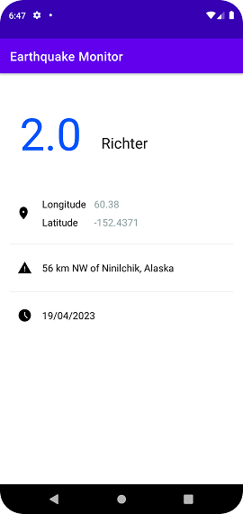

# Earthquake Monitor App

## Temas trabajados en este proyecto:

- API´s y como comunicarte con ellas usando Retrofit
- Parseo de JSON sin librerías y parseo de JSON usando Moshi
- Armado y manejo de base de datos con SQLite
- Comunicación de la APP con la base de datos usando Room
- Relative Layout
- Recycler Views y Adapters
- Traspaso de data entre activities usando Parcelize
- Arquitectura MVVM con ViewModel y Repositorio
- Data binding
- LiveData y Observers
- Option Menu y Ordenamientos distintos del Recycler View
- Configuración de Shared Preferences
- Sincronización de datos de forma eficiente mediante Work Manager

<br>

## Capturas de la app:

<br>

<div style="display:flex;">
  
  
</div>

<br>
<br>

## Instalación

Instala la aplicación con los siguientes pasos:

**Paso 1: Clona el repo**

Usa esto en tu terminal para clonar tu repositorio:
```bash
git clone https://github.com/Mgobeaalcoba/android_kotlin_earthquake_monitor_app.git
```
También puedes descargarla como Zip en caso de que aún no sepas usar Git & Github

**Paso 2: Abre el proyecto en Android Studio**

Abre Android Studio y selecciona "Open project". Luego busca en tu directorio donde clonaste (o descargaste y descomprimiste) el proyecto. Selecciona la carpeta raiz del mismo y dale aceptar. Listo! Ya estás en el proyecto. Y puedas ver como está compuesto. Sus archivos Kotlin para armar la lógica de la app. Sus archivos XML para ver el layout y el diseño de cada Activity.

**Paso 3: Ejecuta el proyecto y revisa que funcione correctamente**

Abre el proyecto en Android Studio y ejecútalo con el botón "run". Previamente debes tener creado un dispositivo de emulación o en su defecto emparejado un dispositivo físico Android donde puedas instalar y luego ejecutar la app.

Proximamente en Play Store!!!

**Developer: Mariano Gobea Alcoba gobeamariano@gmail.com**

